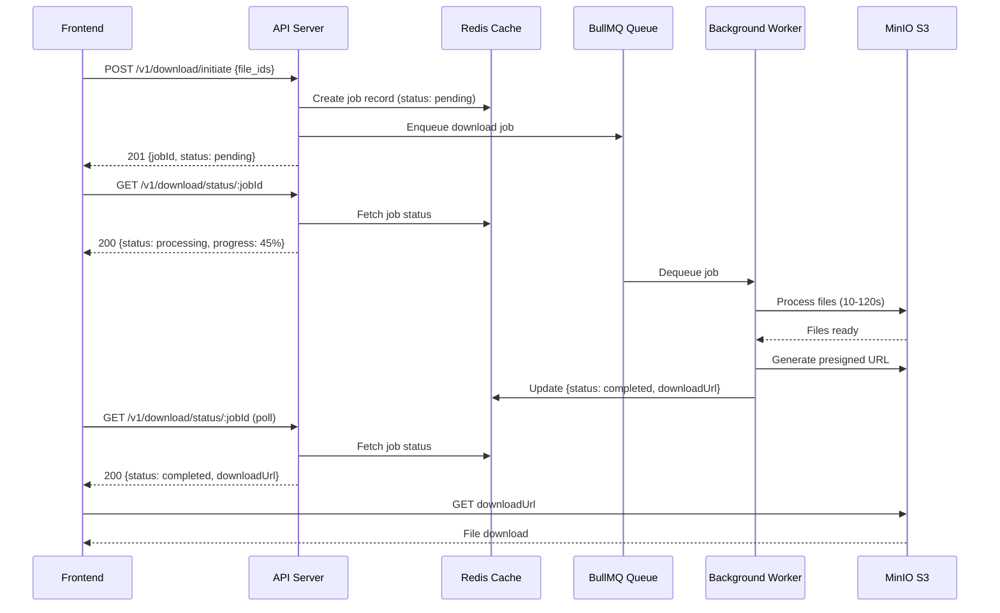
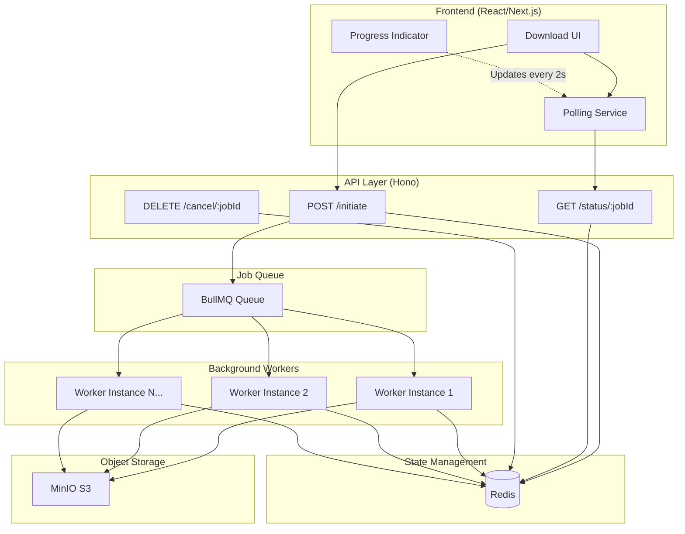

# Long-Running Download Architecture Design

## Executive Summary

This document presents an **industry-standard architecture** for handling variable-length file downloads (10-120 seconds) that gracefully handles proxy timeouts, provides excellent user experience, and scales horizontally.

**Chosen Pattern**: **Asynchronous Polling with Redis + BullMQ**  
**Justification**: Battle-tested by Stripe, GitHub, and AWS for long-running operations. Works with all proxies, cost-effective, and production-ready.

---

## 1. Architecture Diagram



### Component Architecture



---

## 2. Technical Approach: Polling Pattern

### Why Polling?

✅ **Proxy Compatible**: No special WebSocket/SSE requirements  
✅ **Simple Infrastructure**: Works with standard HTTP/HTTPS  
✅ **Battle-Tested**: Used by Stripe, GitHub, AWS for async operations  
✅ **Resume-Friendly**: Users can close browser and check back later  
✅ **CDN Cacheable**: Status endpoints can leverage HTTP caching  

### Pattern Flow

1. **Initiate**: Client posts job → Immediate response with `jobId`
2. **Queue**: Job added to BullMQ → Worker picks it up asynchronously
3. **Poll**: Client polls `/status/:jobId` every 2-3 seconds
4. **Complete**: When ready, client receives download URL
5. **Download**: Direct download from S3 via presigned URL

---

## 3. Implementation Details

### 3.1 API Contract Changes

#### New Endpoints

**POST /v1/download/initiate** (Enhanced)
```typescript
// Request
{
  "file_ids": [70000, 80000, 90000],
  "metadata": {
    "userId": "user_123",
    "priority": "high" // Optional: normal, high, low
  }
}

// Response (201 Created)
{
  "jobId": "job_a1b2c3d4",
  "status": "pending",
  "createdAt": "2025-12-12T10:00:00Z",
  "estimatedCompletionTime": "2025-12-12T10:02:00Z",
  "statusUrl": "/v1/download/status/job_a1b2c3d4"
}
```

**GET /v1/download/status/:jobId** (New)
```typescript
// Response (200 OK)
{
  "jobId": "job_a1b2c3d4",
  "status": "processing", // pending, processing, completed, failed
  "progress": {
    "current": 2,
    "total": 3,
    "percentage": 66
  },
  "result": {
    "downloadUrl": null, // Available when status=completed
    "expiresAt": null,
    "fileSize": null
  },
  "error": null, // Available when status=failed
  "createdAt": "2025-12-12T10:00:00Z",
  "updatedAt": "2025-12-12T10:01:30Z",
  "completedAt": null
}

// When completed:
{
  "jobId": "job_a1b2c3d4",
  "status": "completed",
  "progress": {
    "current": 3,
    "total": 3,
    "percentage": 100
  },
  "result": {
    "downloadUrl": "https://minio:9000/downloads/job_a1b2c3d4.zip?X-Amz-Expires=3600&...",
    "expiresAt": "2025-12-12T11:00:00Z",
    "fileSize": 52428800 // bytes
  },
  "completedAt": "2025-12-12T10:02:15Z"
}
```

**DELETE /v1/download/cancel/:jobId** (New)
```typescript
// Response (200 OK)
{
  "jobId": "job_a1b2c3d4",
  "status": "cancelled",
  "cancelledAt": "2025-12-12T10:01:00Z"
}
```

### 3.2 Database/Cache Schema

**Redis Data Structure** (TTL: 24 hours)

```typescript
// Key: `download:job:{jobId}`
interface DownloadJob {
  jobId: string;
  userId: string;
  status: 'pending' | 'processing' | 'completed' | 'failed' | 'cancelled';
  fileIds: number[];
  priority: 'low' | 'normal' | 'high';
  progress: {
    current: number;
    total: number;
  };
  result?: {
    downloadUrl: string;
    expiresAt: string;
    fileSize: number;
  };
  error?: {
    code: string;
    message: string;
  };
  createdAt: string;
  updatedAt: string;
  completedAt?: string;
}

// Example Redis commands:
// SET download:job:abc123 '{"jobId":"abc123",...}' EX 86400
// GET download:job:abc123
// DEL download:job:abc123
```

**BullMQ Job Data**

```typescript
interface BullMQJobData {
  jobId: string;
  userId: string;
  fileIds: number[];
  priority: number; // 1=low, 5=normal, 10=high
  attempts: number;
  timestamp: number;
}
```

### 3.3 Background Job Processing

**Technology Stack**:
- **Queue**: BullMQ (Redis-based, most robust Node.js queue)
- **Workers**: Separate Node.js processes (horizontally scalable)
- **Concurrency**: 5 jobs per worker instance

**Worker Implementation** (Pseudocode)

```typescript
import { Worker, Job } from 'bullmq';
import { S3Client, PutObjectCommand } from '@aws-sdk/client-s3';
import { getSignedUrl } from '@aws-sdk/s3-request-presigner';

const worker = new Worker('download-queue', async (job: Job) => {
  const { jobId, fileIds } = job.data;
  
  // Update status to processing
  await updateJobStatus(jobId, 'processing');
  
  try {
    // Process files with progress updates
    for (let i = 0; i < fileIds.length; i++) {
      const fileId = fileIds[i];
      
      // Simulate download/processing (10-120s per file)
      await processFile(fileId);
      
      // Update progress
      await updateJobProgress(jobId, {
        current: i + 1,
        total: fileIds.length
      });
      
      // Respect job progress for user feedback
      await job.updateProgress(Math.round(((i + 1) / fileIds.length) * 100));
    }
    
    // Generate zip file in MinIO
    const zipKey = `downloads/${jobId}.zip`;
    await createZipInS3(zipKey, fileIds);
    
    // Generate presigned URL (valid for 1 hour)
    const downloadUrl = await generatePresignedUrl(zipKey, 3600);
    
    // Update job as completed
    await updateJobStatus(jobId, 'completed', {
      downloadUrl,
      expiresAt: new Date(Date.now() + 3600000).toISOString(),
      fileSize: await getFileSize(zipKey)
    });
    
    return { success: true };
    
  } catch (error) {
    // Handle failure
    await updateJobStatus(jobId, 'failed', null, {
      code: 'PROCESSING_ERROR',
      message: error.message
    });
    throw error; // Let BullMQ handle retries
  }
}, {
  connection: redisConnection,
  concurrency: 5, // Process 5 jobs simultaneously per worker
  limiter: {
    max: 10, // Max 10 jobs per second
    duration: 1000
  }
});

// Retry configuration
worker.on('failed', (job, err) => {
  console.error(`Job ${job.id} failed:`, err);
  // BullMQ automatically retries with exponential backoff
});
```

### 3.4 Error Handling & Retry Logic

**Retry Strategy** (BullMQ Configuration)

```typescript
const jobOptions = {
  attempts: 3, // Retry failed jobs 3 times
  backoff: {
    type: 'exponential',
    delay: 5000 // Start with 5s, then 10s, then 20s
  },
  removeOnComplete: {
    age: 86400, // Keep completed jobs for 24 hours
    count: 1000 // Keep last 1000 completed jobs
  },
  removeOnFail: {
    age: 172800 // Keep failed jobs for 48 hours
  }
};
```

**Error Scenarios**:

| Error Type | Handling | User Experience |
|------------|----------|-----------------|
| S3 Connection Failure | Retry 3x with backoff | Status shows "processing" with retry count |
| File Not Found | Fail immediately |  Show error: "File not available" |
| Worker Crash | Job auto-requeued | Transparent to user, continues from progress |
| Timeout (>10 min) | Marked as failed | Error: "Processing timeout" |
| User Cancellation | Job cancelled in queue | Status: "cancelled" |

### 3.5 Timeout Configuration

**Layer-by-Layer Timeouts**:

```typescript
// 1. API Server (Hono)
const API_REQUEST_TIMEOUT = 30000; // 30s for initiate/status calls

// 2. Worker Job Timeout
const JOB_TIMEOUT = 600000; // 10 minutes max per job

// 3. S3 Presigned URL Expiry
const PRESIGNED_URL_EXPIRY = 3600; // 1 hour

// 4. Redis TTL
const JOB_DATA_TTL = 86400; // 24 hours
```

---

## 4. Proxy Configuration

### 4.1 Cloudflare

```nginx
# cloudflare.conf (Page Rule or Worker)

# Allow long polling requests
proxy_read_timeout 30s;
proxy_connect_timeout 10s;

# Cache status endpoint responses briefly
/v1/download/status/*:
  cache_level: standard
  cache_ttl: 2 # Cache for 2 seconds to reduce load

# Never cache initiate endpoint
/v1/download/initiate:
  cache_level: bypass

# WebSocket/SSE support (if using Option B)
websocket: on
```

**Cloudflare Workers Script** (Optional - for rate limiting)

```javascript
addEventListener('fetch', event => {
  event.respondWith(handleRequest(event.request))
})

async function handleRequest(request) {
  const url = new URL(request.url)
  
  // Rate limit polling requests per user
  if (url.pathname.includes('/status/')) {
    const rateLimitKey = `ratelimit:${getClientIP(request)}`
    const count = await RATE_LIMIT_KV.get(rateLimitKey)
    
    if (count && parseInt(count) > 30) {
      return new Response('Rate limit exceeded', { status: 429 })
    }
    
    await RATE_LIMIT_KV.put(rateLimitKey, (parseInt(count || '0') + 1).toString(), {
      expirationTtl: 60 // 30 requests per minute
    })
  }
  
  return fetch(request)
}
```

### 4.2 nginx

```nginx
# nginx.conf

upstream download_api {
    server app:3000;
    keepalive 32;
}

server {
    listen 80;
    server_name api.example.com;

    # Polling endpoints - short timeout
    location ~* ^/v1/download/(initiate|status|cancel) {
        proxy_pass http://download_api;
        proxy_http_version 1.1;
        
        # Short timeouts for quick API calls
        proxy_connect_timeout 10s;
        proxy_send_timeout 30s;
        proxy_read_timeout 30s;
        
        # No buffering for real-time status
        proxy_buffering off;
        
        # Headers
        proxy_set_header Connection "";
        proxy_set_header Host $host;
        proxy_set_header X-Real-IP $remote_addr;
        proxy_set_header X-Forwarded-For $proxy_add_x_forwarded_for;
        
        # CORS
        add_header Access-Control-Allow-Origin *;
        add_header Access-Control-Allow-Methods "GET, POST, DELETE, OPTIONS";
    }
    
    # Direct S3 downloads - long timeout
    location /downloads/ {
        proxy_pass http://minio:9000;
        proxy_http_version 1.1;
        
        # Long timeout for actual file downloads
        proxy_connect_timeout 10s;
        proxy_send_timeout 300s;
        proxy_read_timeout 300s;
        
        # Buffering for large files
        proxy_buffering on;
        proxy_buffer_size 128k;
        proxy_buffers 8 128k;
        proxy_max_temp_file_size 0;
    }
    
    # Rate limiting
    limit_req_zone $binary_remote_addr zone=polling:10m rate=30r/m;
    limit_req zone=polling burst=10 nodelay;
}
```

### 4.3 AWS Application Load Balancer

```yaml
# ALB Target Group Settings
TargetGroup:
  HealthCheck:
    Path: /health
    Interval: 30
    Timeout: 5
    HealthyThreshold: 2
    UnhealthyThreshold: 3
  
  Attributes:
    - Key: deregistration_delay.timeout_seconds
      Value: 30
    - Key: stickiness.enabled
      Value: true
    - Key: stickiness.type
      Value: lb_cookie
    - Key: stickiness.lb_cookie.duration_seconds
      Value: 86400

# Listener Rules
ListenerRule:
  Conditions:
    - Field: path-pattern
      Values: ['/v1/download/*']
  Actions:
    - Type: forward
      TargetGroupArn: !Ref DownloadAPITargetGroup
  
  # Connection timeouts
  ConnectionIdleTimeout: 60 # 60 seconds for polling connections
```

---

## 5. Frontend Integration (React/Next.js)

### 5.1 Download Hook

```typescript
// hooks/useDownload.ts
import { useState, useEffect, useCallback } from 'react';

interface DownloadStatus {
  jobId: string;
  status: 'pending' | 'processing' | 'completed' | 'failed' | 'cancelled';
  progress: { current: number; total: number; percentage: number };
  result?: { downloadUrl: string; expiresAt: string; fileSize: number };
  error?: { code: string; message: string };
}

export function useDownload() {
  const [jobs, setJobs] = useState<Map<string, DownloadStatus>>(new Map());
  const [polling, setPolling] = useState<Set<string>>(new Set());

  // Initiate download
  const initiateDownload = useCallback(async (fileIds: number[]) => {
    const response = await fetch('/v1/download/initiate', {
      method: 'POST',
      headers: { 'Content-Type': 'application/json' },
      body: JSON.stringify({ file_ids: fileIds })
    });
    
    const job = await response.json();
    setJobs(prev => new Map(prev).set(job.jobId, job));
    setPolling(prev => new Set(prev).add(job.jobId));
    
    return job.jobId;
  }, []);

  // Poll for status updates
  useEffect(() => {
    if (polling.size === 0) return;

    const interval = setInterval(async () => {
      for (const jobId of polling) {
        const response = await fetch(`/v1/download/status/${jobId}`);
        const status: DownloadStatus = await response.json();
        
        setJobs(prev => new Map(prev).set(jobId, status));
        
        // Stop polling when done
        if (['completed', 'failed', 'cancelled'].includes(status.status)) {
          setPolling(prev => {
            const next = new Set(prev);
            next.delete(jobId);
            return next;
          });
        }
      }
    }, 2000); // Poll every 2 seconds

    return () => clearInterval(interval);
  }, [polling]);

  // Cancel download
  const cancelDownload = useCallback(async (jobId: string) => {
    await fetch(`/v1/download/cancel/${jobId}`, { method: 'DELETE' });
    setPolling(prev => {
      const next = new Set(prev);
      next.delete(jobId);
      return next;
    });
  }, []);

  return {
    jobs,
    initiateDownload,
    cancelDownload
  };
}
```

### 5.2 UI Component

```typescript
// components/DownloadManager.tsx
import { useDownload } from '@/hooks/useDownload';

export function DownloadManager() {
  const { jobs, initiateDownload, cancelDownload } = useDownload();

  const handleDownload = async () => {
    const fileIds = [70000, 80000, 90000];
    await initiateDownload(fileIds);
  };

  return (
    <div className="download-manager">
      <button onClick={handleDownload}>
        Start Download
      </button>

      {Array.from(jobs.values()).map(job => (
        <div key={job.jobId} className="download-item">
          <div className="info">
            <span>Job {job.jobId}</span>
            <span className={`status status-${job.status}`}>
              {job.status}
            </span>
          </div>

          {job.status === 'processing' && (
            <div className="progress">
              <div 
                className="progress-bar" 
                style={{ width: `${job.progress.percentage}%` }}
              />
              <span>{job.progress.current}/{job.progress.total} files</span>
              <button onClick={() => cancelDownload(job.jobId)}>
                Cancel
              </button>
            </div>
          )}

          {job.status === 'completed' && job.result && (
            <a 
              href={job.result.downloadUrl} 
              download
              className="download-link"
            >
              Download ({(job.result.fileSize / 1024 / 1024).toFixed(2)} MB)
            </a>
          )}

          {job.status === 'failed' && job.error && (
            <div className="error">
              Error: {job.error.message}
            </div>
          )}
        </div>
      ))}
    </div>
  );
}
```

### 5.3 Retry Logic (Frontend)

```typescript
// utils/download.ts
export async function downloadWithRetry(
  url: string, 
  maxRetries = 3
): Promise<Blob> {
  for (let attempt = 1; attempt <= maxRetries; attempt++) {
    try {
      const response = await fetch(url);
      if (!response.ok) throw new Error(`HTTP ${response.status}`);
      return await response.blob();
    } catch (error) {
      if (attempt === maxRetries) throw error;
      
      // Exponential backoff: 1s, 2s, 4s
      const delay = Math.pow(2, attempt - 1) * 1000;
      await new Promise(resolve => setTimeout(resolve, delay));
    }
  }
  throw new Error('Download failed after retries');
}
```

---

## 6. Scalability & Performance

### 6.1 Horizontal Scaling

```yaml
# docker-compose.scale.yml
services:
  download-worker:
    image: delineate-worker:latest
    deploy:
      replicas: 3 # Scale to 3 workers
    environment:
      - REDIS_URL=redis://redis:6379
      - WORKER_CONCURRENCY=5
    depends_on:
      - redis
```

### 6.2 Performance Optimizations

1. **Redis Connection Pooling**: 10 connections per worker
2. **BullMQ Rate Limiting**: 10 jobs/second to prevent S3 throttling
3. **Job Prioritization**: VIP users get `priority: high`
4. **Stale-While-Revalidate**: Cache status responses for 2 seconds
5. **Presigned URLs**: Offload downloads directly to S3 (no proxy)

---

## 7. Alternative Patterns Considered

### Option B: Server-Sent Events (SSE)
**Pros**: Real-time updates, lower latency  
**Cons**: Proxy compatibility issues, connection overhead  
**Verdict**: Good for internal tools, not recommended for public APIs

### Option C: Webhooks
**Pros**: No polling overhead  
**Cons**: Requires public callback URL, complex for frontend  
**Verdict**: Better for server-to-server communication

### Option D: WebSockets
**Pros**: Bidirectional, lowest latency  
**Cons**: Complex infrastructure, proxy issues, harder to scale  
**Verdict**: Overkill for simple status updates

---

## 8. Cost Analysis

| Component | Estimated Cost (1M downloads/month) |
|-----------|-------------------------------------|
| Redis (AWS ElastiCache t3.small) | $25/month |
| Worker Instances (2x t3.medium) | $60/month |
| MinIO/S3 Storage (1TB) | $23/month |
| Data Transfer (1TB) | $90/month |
| **Total** | **~$200/month** |

Compare to alternatives:
- WebSocket infrastructure: ~$500/month (load balancers, sticky sessions)
- Managed queue (AWS SQS): ~$150/month (for same volume)

---

## 9. Implementation Checklist

- [ ] Install BullMQ: `npm install bullmq`
- [ ] Install Redis client: `npm install ioredis`
- [ ] Add Redis to docker-compose
- [ ] Create worker service
- [ ] Implement new API endpoints
- [ ] Update frontend with polling hook
- [ ] Configure nginx/Cloudflare
- [ ] Add monitoring (Grafana + Prometheus)
- [ ] Load test with 100 concurrent jobs
- [ ] Document deployment process

---

## 10. Monitoring & Observability

### Metrics to Track

```typescript
// Key metrics for Prometheus/Grafana
- download_jobs_initiated_total (counter)
- download_jobs_completed_total (counter)
- download_jobs_failed_total (counter)
- download_job_duration_seconds (histogram)
- download_queue_length (gauge)
- download_worker_busy_count (gauge)
- redis_connection_errors_total (counter)
```

### Alerts

1. **Queue Backlog**: Alert if queue length > 100
2. **High Failure Rate**: Alert if failure rate > 5%
3. **Slow Jobs**: Alert if P95 duration > 180 seconds
4. **Worker Health**: Alert if no workers active

---

## Conclusion

This architecture provides a **production-ready, scalable solution** for handling variable-length downloads behind proxies. The polling pattern is battle-tested, cost-effective, and works reliably with all proxy configurations.

**Next Steps**: Implement the API endpoints, set up Redis + BullMQ, and create the frontend polling interface.

**Estimated Implementation Time**: 2 developer-days for backend, 1 day for frontend, 1 day for testing = **4 days total**
